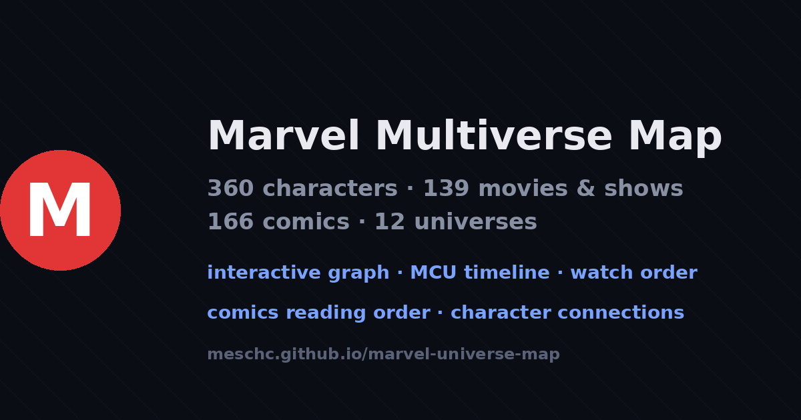
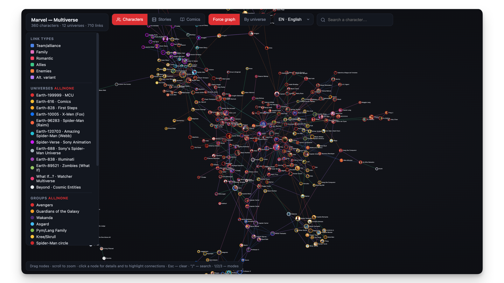

<div align="center">



# 🕸 Marvel Multiverse Map

**An interactive graph of the entire Marvel multiverse — characters, movies, series and comics, and every connection between them.**

[**🌐 Live demo → marvel.kirmesch.ru**](https://marvel.kirmesch.ru/)

[](https://marvel.kirmesch.ru/)
[](LICENSE)
[](https://d3js.org)


🇷🇺 [Русская версия README](README.ru.md)

</div>

---

## What I built

I built a single-page, zero-dependency web app that lays out the whole Marvel universe as an explorable graph. It answers the questions I actually wanted answered as a fan:

- **In what order do I watch the movies and shows?** → the in-universe chronology view.
- **In what order do I read the comics?** → 166 issues across 12 lines, by release year.
- **How is character A connected to character B?** → a force-directed graph with a shortest-path finder.
- **How do the universes overlap?** → MCU, Earth-616, Earth-828, Spider-Verse, Sony, Fox, What If…? and more, colour-coded.

<div align="center">



|  |  |
|:--:|:--:|
| **369** characters | **717** connections |
| **144** movies & series | **166** comics |
| **12** universes | **RU / EN** |

</div>

## ✨ Features

- **Three modes** — Characters (relationship graph), Stories (movie/series timeline), Comics (catalogue by line or by year).
- **Two character layouts** — force-directed graph, or a "star" grouped by universe with the MCU at the centre.
- **Path finder** 🧭 — the shortest chain of connections between any two heroes (e.g. Spider-Man → Thor).
- **Global search** across characters, actors, movies and comics at once.
- **Rich detail cards** — cast, appearances, affiliations, cross-links between modes, "where to watch / read".
- **Bilingual** — English and Russian (extensible dropdown).
- **Mobile-first controls** — bottom menu, slide-up sheets, tap-to-dismiss.
- **Keyboard shortcuts** — `Esc` clear · `/` search · `1` / `2` / `3` modes · `R` reset view.
- **Deep links** — `…/#iron_man` opens a character straight away.
- **Fully static** — no backend, no build.

## 🎬 The three modes

**Characters.** A D3 force simulation of 369 heroes and 717 links, typed as team, family, romantic, ally, enemy and multiverse-variant. Node size = number of connections, ring colour = universe, fill = photo.

**Stories.** 144 films and series on a timeline — grouped by MCU phase or by in-universe chronology, with universe bands showing how the Sony, Fox and animation lines interleave. This is the watch-order view.

**Comics.** 166 key issues in 12 lines (Spider-Man, X-Men, Iron Man, Thor, Captain America, Avengers, Cosmic, Street-Level, plus movie preludes, adaptations, first appearances and classic events), viewable by line or on a shared release-year timeline.

## 📁 Project structure

```
index.html    markup, meta, structured data, script/style includes
styles.css    all styles and the dark theme
data.js       the data (window.DATA): characters, stories, comics, links
app.js        all logic — D3 graph, modes, search, filters, cards, mobile UI
og-image.png  social preview (1200×630)  ·  preview-graph.png  README preview
```

I keep the data in `data.js` as one `DATA` object:

```js
DATA.characters.nodes  // { id, name, name_ru, actor, group, universe, image, … }
DATA.characters.edges  // { source, target, type, label }   type: team|family|romantic|ally|enemy|variant
DATA.stories.nodes     // { id, title, title_ru, type, phase, date, poster, characters[] }
DATA.comics.nodes      // { id, title, title_ru, line, date, cover, tie_in, tie_in_chars[] }
```

To add a character I drop an object into `DATA.characters.nodes`, add at least one edge to `DATA.characters.edges`, and refresh — the graph recomputes itself.

## 🤝 Contributing

I welcome contributions — new characters, connections, titles or fixes. Open a pull request, or file an issue with one of the ready-made templates in [`.github/ISSUE_TEMPLATE`](.github/ISSUE_TEMPLATE). Data changes only touch `data.js`, so they're easy to review.

## 📄 License & credits

Code — [MIT](LICENSE) © **Kirill Denisovich Meshcheryakov** ([kirmesch.ru](https://kirmesch.ru) · [GitHub](https://github.com/meschc) · [Telegram](https://t.me/kirillmeschc)).

Non-commercial fan project. Marvel characters, names, logos and artwork are property of **Marvel / The Walt Disney Company**. Images are loaded from public Fandom wikis ([MCU Wiki](https://marvelcinematicuniverse.fandom.com), [Marvel Database](https://marvel.fandom.com), [Into the Spider-Verse Wiki](https://intothespiderverse.fandom.com)) under CC-BY-SA, for informational use.

Built with [D3.js](https://d3js.org) and [Feather Icons](https://feathericons.com). Assembled and coded with the help of Claude (Claude Cowork by Anthropic).

<div align="center">

⭐ If you like it, star the repo — [**open the live map**](https://marvel.kirmesch.ru/)

</div>
